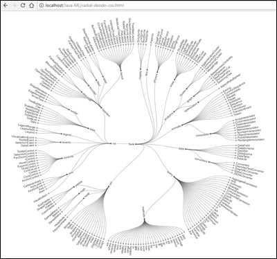

# D3-Visualization
This project is the first project in Chapter 2 of the book:

https://www.apress.com/us/book/9781484239506
# About the Project

This project implement D3 visualization for the desktop browser.

Dendograms are useful for showing hierarchy. The project will explore a variety of dendograms to visualize both CSV and JSON data. 

# Project Details
Project Name: D3 Visualization

Source: d3_vizualization.zip or github.com/wickapps/D3-Visualization

Type: Desktop browser

# File Summary
A short summary of the files included in this project:

| File | Description
| :--- | :---
| d3.min.js | D3 library
| flare.csv | CSV data file
| flare.json | JSON data file
| dendo-csv.html | Dendogram example using CSV data
| tree-dendo-csv.html | Tree Dendogram example using CSV data
| radial-dendo-csv.html | Radial Tree Dendogram example using CSV data
| collapse-tree-json.html | Collapsible Tree Dendogram example using JSON data
| cluster-dendo-json.html | Cluster Dendogram example using JSON data

# Example Output
The example below shows the rendering produced by **radial-dendo-csv.html**

